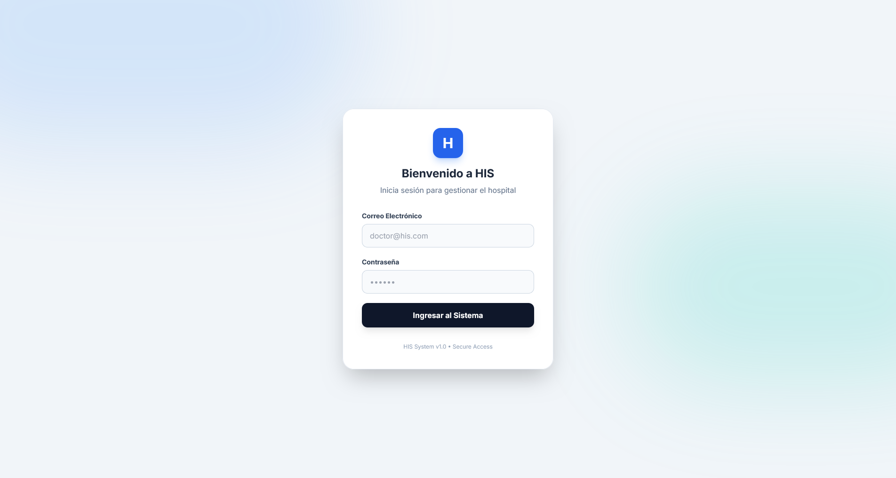
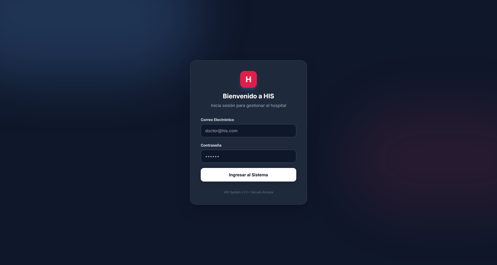
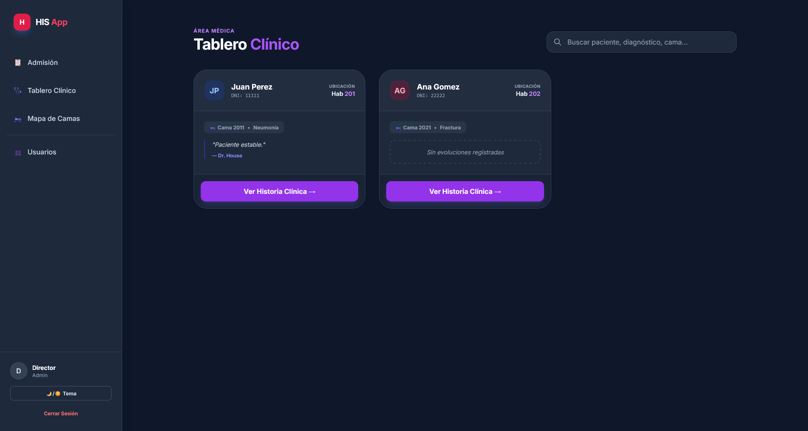
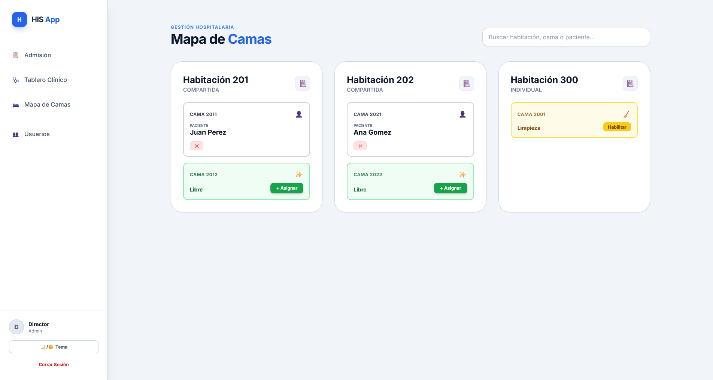

# 🏥 HIS Pro - Sistema de Gestión Hospitalaria

> Sistema integral para la administración de internaciones, gestión de camas y seguimiento clínico en tiempo real.


## 📖 Descripción

**HIS Pro** es una aplicación web Full-Stack diseñada para modernizar la gestión hospitalaria. Permite el control del ciclo completo de un paciente, desde su admisión hasta el alta médica, pasando por la evolución clínica y enfermería.

Destaca por su interfaz moderna **"Bento Style"**, soporte nativo para **Modo Oscuro**, y lógica de negocio avanzada como la validación de género en habitaciones compartidas y ciclos de limpieza de camas.

## ✨ Características Principales

### 🏗️ Infraestructura y Admisión
* **Mapa de Camas Interactivo:** Visualización en tiempo real del estado de las camas (Disponible, Ocupada, En Limpieza).
* **Ciclo de Limpieza:** Al dar de alta, la cama pasa automáticamente a estado "Limpieza" y requiere habilitación manual.
* **Validación Lógica:** Bloqueo automático de asignación en habitaciones compartidas si los pacientes son de sexos opuestos.
* **Buscador en Vivo (AJAX):** Filtrado instantáneo de pacientes y camas sin recargar la página.

### 🩺 Módulo Clínico
* **Roles Diferenciados:** Vistas y permisos específicos para Médicos y Enfermería.
* **Historia Clínica Digital:** Línea de tiempo (Timeline) con evoluciones médicas y controles de signos vitales.
* **Identidad Visual:** Código de colores (Azul para Médicos, Teal para Enfermería) para rápida identificación.

### 🎨 UI/UX (Interfaz)
* **Diseño Bento / Glassmorphism:** Tarjetas flotantes, sombras suaves y estética moderna.
* **Dark Mode:** Cambio de tema Claro/Oscuro persistente.
* **Responsive:** Adaptable a dispositivos móviles y escritorio.

## 🛠️ Tecnologías Utilizadas

* **Backend:** Node.js, Express.js
* **Base de Datos:** SQLite (Entorno Dev), Sequelize ORM.
* **Frontend:** Pug (Motor de plantillas), TailwindCSS (Estilos).
* **Herramientas:** AJAX (Fetch API), Bcrypt (Seguridad), Dotenv.

## 🚀 Instalación y Puesta en Marcha

Sigue estos pasos para correr el proyecto localmente:

1.  **Clonar el repositorio:**
    ```bash
    git clone [https://github.com/tu-usuario/his-final.git](https://github.com/tu-usuario/his-final.git)
    cd his-final
    ```

2.  **Instalar dependencias:**
    ```bash
    npm install
    ```

3.  **Configurar Variables de Entorno:**
    Crea un archivo `.env` en la raíz y agrega:
    ```env
    PORT=3000
    SESSION_SECRET=palabra_secreta_super_segura
    ```

4.  **Cargar Datos de Prueba (Seed):**
    Este comando crea la base de datos, las tablas y usuarios ficticios para probar.
    ```bash
    node seed.js
    ```

5.  **Iniciar el Servidor:**
    ```bash
    npm run dev
    ```
    Visita `http://localhost:3000` en tu navegador.

## 🔑 Credenciales de Prueba

El `seed.js` genera los siguientes usuarios para testear los diferentes roles:

| Rol | Email | Contraseña |
| :--- | :--- | :--- |
| **Administrador** | `admin@his.com` | `123456` |
| **Médico** | `medico@his.com` | `123456` |
| **Enfermería** | `enfermera@his.com`| `123456` |
| **Admisión** | `admision@his.com` | `123456` |

## 📂 Estructura del Proyecto

```text
src/
├── controllers/    # Lógica de negocio (Admisión, Clínica, Habitaciones)
├── models/         # Modelos de BD (Paciente, Cama, Evolución, Usuario)
├── routes/         # Definición de rutas Express
├── views/          # Plantillas PUG (Layouts, Partials, Vistas)
│   ├── admin/      # Gestión de usuarios
│   ├── admission/  # Listados y formularios de pacientes
│   ├── auth/       # Login
│   ├── clinical/   # Dashboards médicos y enfermería
│   ├── rooms/      # Mapa de camas
│   └── layouts/    # Plantilla base (Main)
└── app.js          # Punto de entrada de la aplicación

```

## 📸 Capturas de Pantalla

### 1. Login & Seguridad
_Diseño moderno tipo "Glass" con validaciones visuales._



### 2. Tablero Clínico (Modo Oscuro)
_Interfaz Bento con línea de tiempo médica y búsqueda en vivo._


### 3. Gestión de Camas e Infraestructura
_Mapa interactivo con estados: Disponible (Verde), Ocupada (Rojo) y En Limpieza (Amarillo)._
